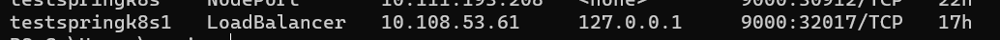

#Spring boot + Docker + K8S 
Project to demonstrate springboot with docker and deploying
it to local k8s cluster hosted with minikube.

#Setup
Make sure you have minikube installed
Make sure you have kubectl installed
Make sure you have docker installed
Dockerhub account to push the images

#Steps
1.Create springboot project with following dependencies
from start.spring.io
2.Sample Docker file reference to create the image
```
FROM openjdk:13
EXPOSE 9000
ARG JAR_FILE= ./target/spring-dockr-k8s-0.0.1-SNAPSHOT.jar
ADD ./target/spring-dockr-k8s-0.0.1-SNAPSHOT.jar app.jar
ENTRYPOINT ["java","-jar","/app.jar"]
```
3. Pom file changes to build and push the image to dockerhub
```
            <plugin>
				<groupId>com.spotify</groupId>
				<artifactId>dockerfile-maven-plugin</artifactId>
				<version>${dockerfile-maven-version}</version>
				<executions>
					<execution>
						<id>default</id>
						<goals>
							<goal>build</goal>
							<goal>push</goal>
						</goals>
					</execution>
				</executions>
				<configuration>
					<username>username</username>
					<password>******</password>
					<repository>sanjaybsm/spring-dockr-k8s</repository>
					<tag>latest</tag>

					<!--
                                        <tag>${project.version}</tag>
                    -->
					<buildArgs>
						<JAR_FILE>${project.build.finalName}.jar</JAR_FILE>
					</buildArgs>
				</configuration>
			</plugin>
```
#commands
Start minikube

```minikube start```

Start the minikube tunnel so that you can access the app outside k8s cluster
```
minikube tunnel
```
_keep the tunnel open, and this change is needed for windows._

Create deployment
```
kubectl create deployment testspringk8s --image={dockerhub_username}/{image_name}:{version}
ex:
kubectl create deployment testspringk8s --image=sanjaybsm/spring-dockr-k8s
```

Expose Deployment
```
kubectl expose deployment testspringk8s --type=LoadBalancer --port=9000
```

Run this command to know the externalIp assigned
```
kubectl get svc
```
It should show something like below


_if it's pending it means that your tunnel is not running or some issue with your minikube_

#reference
https://minikube.sigs.k8s.io/docs/handbook/accessing/


